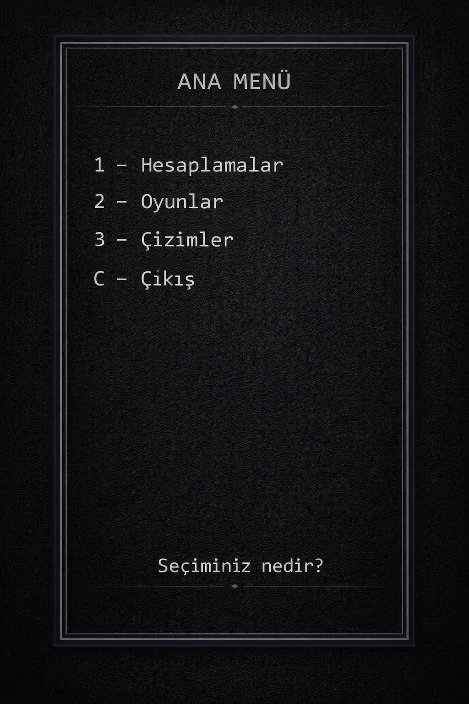

# vectorelapp_proje1
h2>Proje Görselleri</h2>

<table>
  <tr>
    <td width="320" align="center">
      
    </td>
    <td>
      <b>Ana Menü</b>  
      Bu görsel uygulamanın başlangıç ekranını göstermektedir.
      Kullanıcı buradan hesaplamalar, oyunlar ve çizimler bölümlerine geçebilir.
    </td>
  </tr>
</table>

 

<table>
  <tr>
    <td>
      <b>Hesaplamalar Menüsü</b>  
      Bu bölümde toplama, çıkarma, çarpma, bölme, yüzde hesaplama ve ortalama hesaplama işlemleri bulunmaktadır.
    </td>
    <td width="320" align="center">
      
    </td>
  </tr>
</table>

 

<table>
  <tr>
    <td width="320" align="center">
      
    </td>
    <td>
      <b>Oyunlar Menüsü</b>  
      Bu bölümde taş kağıt makas, sayı tahmini ve zar atma gibi eğlenceli oyun seçenekleri yer almaktadır.
    </td>
  </tr>
</table>

 

<table>
  <tr>
    <td>
      <b>Çizimler Menüsü</b>  
      Bu alanda Turtle kütüphanesi ile hazırlanmış görsel çizimler ve desenler gösterilmektedir.
    </td>
    <td width="320" align="center">
      
    </td>
  </tr>
</table>

